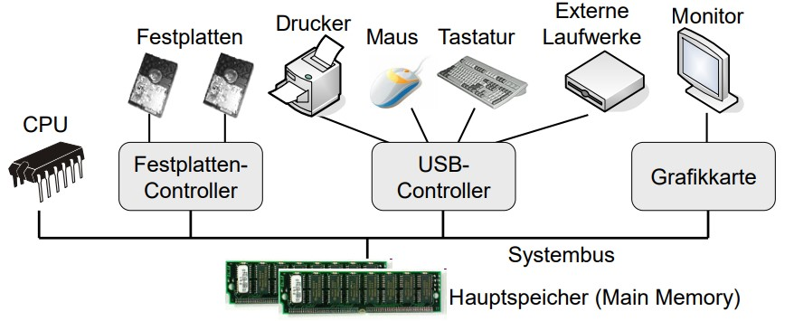
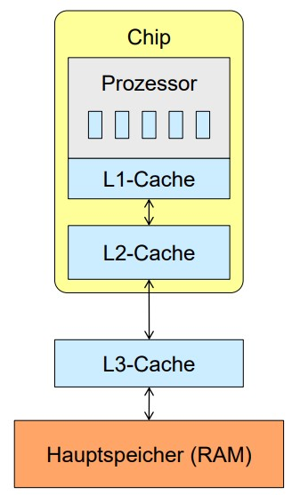

# The Structure of a Computer

## Separation of a computer in four sections

- **Hardware :**

    collection of devices that allow the execution of programs

- **OS :**

    management and coordination of system hardware

- **Software :**

    any program that can be executed inside the OS

- **User :**

    any device or being that can interact with the system

## Hardware (simplified)

- Systembus connects all devices
  - one or more CPUs for program execution
  - shared memory for tasks of the CPU and other devices
  - Controller for IO devices
    - Hard Drives
    - HID
    - Network Interface
    - ...

## Computer Architecture : von-Neumann

- reference model for computers
- separation between code execution and data
  - Separation between CPU and memory
  - Separation between Execution Unit and ALU
- this adds component communication overhead in program execution
  - Data has to be moved from memory to CPU and back, to be used
  - the OS provides functionality to use the given resources efficiently

- CPU has multiple registers
  - data registers, address registers, special registers, ...
- additional cache
  - fast buffer memory
  - access to cache is much faster compared to memory access
  - smaller cache = lower access times
  - caches are transparent to the OS
  - Types of cache
    - L1-cache
      - close to the main execution unit, very small, very little latency
      - saves future instructions for faste execution
    - L2-cache
      - larger and slightly slower
    - L3-cache
      - faster than main memory
      - smaller than main memory
      - extra chip outside the main processor

    

- registers tend to be very small, no more than the size of a DWORD but extremely fast
  - used for calculation or comparison
- cache is still very fast, but is usually slower than registers, while having a larger size
- main memory is very large, but needs many cycles to move data to CPU
  - OS needs to handle access times and data transport
  - every time we access data from a hard drive, we have to stop program execution so the processor can continue

## Processor Cores and Caches

- each CPU tends to have its own L1 and L2 cache, sharing the L3 cache between all cores
- all processors can access system BUS and main memory individually
- communication and access latency is still a bottleneck in modern hardware

- Hyperthreading
  - process interweaving, so that program execution can be sped up

## Hardware component interplay

- CPU executes operations
- CPU and IO-devices are used asynchronously
  - every IO-controller controls one type of device
  - the CPU is needed to execute an operation
    - every controller has its own registers
    - CPU moves data from main memory and cache
    - operation is started after moving the data
  - Today: _DMA (Direct Memory Access)_
    - seperate controller for the movement of data
    - takes load away from CPU
- Hardware Interrupts tell the CPU when an external task is done
  - CPU tries to access HDD
  - HDD Controller starts to work on retrieving the data
  - CPU continues to work on other stuff
  - HDD controller sends an interrupt signal to CPU
  - CPU stops and listens to HDD controller
  - data has an end-marker, if end is reached, CPU continues to work.

## Simplified computer architecture

## The OS

- Collection of Programs that allow efficient and comfortable use of a computer
  - Platform for program execution on computer hardware
- System resources can be Hardware or software
  - **Processors**, **Processes**, **Threads**
  - **Memory**
    - Main Memory, Cache, virtual Memory
  - **Filesystem**
    - Directories, Files
  - **I/O devices**
    - Graphics card, Network interface card, Harddrives, Peripherals
- Classification:
  - can it be shareed etween processes? (y/n)
  - can we remove a resource from a process?

### The Development of Operating Systems

#### [Main Focus of OS development](https://en.wikipedia.org/wiki/Timeline_of_operating_systems)

- **Mainframes** (1950)
- **"Mini-computers"** (1960)
- **Desktop-Computers** (1970)
- **Handheld-Computers** (1990)
- **AP's, Sensor-nodes, Smartphones, Tablets...** (2000)
- **IoT, Cyber-physical systems, Smartwatches...** (2010+)

#### Today's Operating Systems:

- **MS-DOS Kernel** (EOL in 2001):
  - Windows 1.0 - 3.11
  - Windows 95
  - Windows 98
  - Windows Me
- **Windows NT Kernel**:
  - Windows NT
  - Windows 2000
  - Windows XP
  - Windows Vista
  - Windows 7
  - Windows 8/8.1
  - Windows 10
  - Windows Server
- **UNIX Kernel**:
  - Sun Solaris
  - HP UX
  - Linux
    - Debian (APT)
      - Ubuntu
      - Parrot OS
    - Arch Linux (Pacman)
      - Manjaro
      - Arco Linux
    - RHEL
    - SUSE
    - Gentoo
    - LFS
    - Android
  - BSD
  - Mac OS
  - iOS
  - ...
- TinyOS
- Contiki
- ...

#### OS Distribution in Germany

- **March 2014**
  
- **January 2016**
  

- **January 2009 to January 2019 (Desktop OS)**
  

- **January 2009 to January 2019 (Mobile OS)**
  
