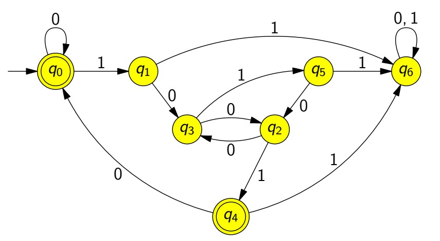

# Introductory example

look at the following problem:

Input: a string `w` consisting of 0s and 1s

Question: Are these requirements fullfilled?

- 1 is not a sub-word
- `w` is divisible by 3 in binary

Examples: `0101, 1001, 00110, 0101010`

We want:

A program that takes `w` as argument and returns 0 or 1

## A possible solution (cryptic C code)

```c
int F[] = { 1, 0, 0, 0, 1, 0, 0 };
int delta[][2] = { { 0, 1 }, { 3, 6 }, { 3, 4 }, { 2, 5 }, { 0, 6 }, { 2, 6 }, { 6, 6 }  };

int three_not_11(char *w)
{
    int q = 0;
    while( *w ) q = delta[ q ][ *w++ - '0' ];
    return F[q];
}
```

## Finite Automaton



q0 is start
q6 is default false (11 is sub-word)
q1-q5 are possible paths
q0 & q4 are true paths

## Artificial plants

Drawing Program knows the Following instructions

- `F` draw short line
- `-` turn right
- `+` turn left
- `[` save current position
- `]` go back to last saved position

`F[+FF][--F]F[]+F[+FF][--F]FF[+FF][--F]F][--F[+FF][--F]F]F[+FF][--F]F`

Start with `F` and use `F -> F[+FF][--F]F` for n-times

here an example generated with **n=4***

```none
F

F[+FF][--F]F

F[+FF][--F]F[+F[+FF][--F]FF[+FF][--F]F][--F[+FF][--F]F]F[+FF][--F]F

F[+FF][--F]F[+F[+FF][--F]FF[+FF][--F]F][--F[+FF][--F]F]F[+FF][--F]F[+F[+FF][--F]F[+F[+FF][--F]FF[+FF][--F]F][--F[+FF][--F]F]F[+FF][--F]FF[+FF][--F]F[+F[+FF][--F]FF[+FF][--F]F][--F[+FF][--F]F]F[+FF][--F]F][--F[+FF][--F]F[+F[+FF][--F]FF[+FF][--F]F][--F[+FF][--F]F]F[+FF][--F]F]F[+FF][--F]F[+F[+FF][--F]FF[+FF][--F]F][--F[+FF][--F]F]F[+FF][--F]F

F[+FF][--F]F[+F[+FF][--F]FF[+FF][--F]F][--F[+FF][--F]F]F[+FF][--F]F[+F[+FF][--F]F[+F[+FF][--F]FF[+FF][--F]F][--F[+FF][--F]F]F[+FF][--F]FF[+FF][--F]F[+F[+FF][--F]FF[+FF][--F]F][--F[+FF][--F]F]F[+FF][--F]F][--F[+FF][--F]F[+F[+FF][--F]FF[+FF][--F]F][--F[+FF][--F]F]F[+FF][--F]F]F[+FF][--F]F[+F[+FF][--F]FF[+FF][--F]F][--F[+FF][--F]F]F[+FF][--F]F[+F[+FF][--F]F[+F[+FF][--F]FF[+FF][--F]F][--F[+FF][--F]F]F[+FF][--F]F[+F[+FF][--F]F[+F[+FF][--F]FF[+FF][--F]F][--F[+FF][--F]F]F[+FF][--F]FF[+FF][--F]F[+F[+FF][--F]FF[+FF][--F]F][--F[+FF][--F]F]F[+FF][--F]F][--F[+FF][--F]F[+F[+FF][--F]FF[+FF][--F]F][--F[+FF][--F]F]F[+FF][--F]F]F[+FF][--F]F[+F[+FF][--F]FF[+FF][--F]F][--F[+FF][--F]F]F[+FF][--F]FF[+FF][--F]F[+F[+FF][--F]FF[+FF][--F]F][--F[+FF][--F]F]F[+FF][--F]F[+F[+FF][--F]F[+F[+FF][--F]FF[+FF][--F]F][--F[+FF][--F]F]F[+FF][--F]FF[+FF][--F]F[+F[+FF][--F]FF[+FF][--F]F][--F[+FF][--F]F]F[+FF][--F]F][--F[+FF][--F]F[+F[+FF][--F]FF[+FF][--F]F][--F[+FF][--F]F]F[+FF][--F]F]F[+FF][--F]F[+F[+FF][--F]FF[+FF][--F]F][--F[+FF][--F]F]F[+FF][--F]F][--F[+FF][--F]F[+F[+FF][--F]FF[+FF][--F]F][--F[+FF][--F]F]F[+FF][--F]F[+F[+FF][--F]F[+F[+FF][--F]FF[+FF][--F]F][--F[+FF][--F]F]F[+FF][--F]FF[+FF][--F]F[+F[+FF][--F]FF[+FF][--F]F][--F[+FF][--F]F]F[+FF][--F]F][--F[+FF][--F]F[+F[+FF][--F]FF[+FF][--F]F][--F[+FF][--F]F]F[+FF][--F]F]F[+FF][--F]F[+F[+FF][--F]FF[+FF][--F]F][--F[+FF][--F]F]F[+FF][--F]F]F[+FF][--F]F[+F[+FF][--F]FF[+FF][--F]F][--F[+FF][--F]F]F[+FF][--F]F[+F[+FF][--F]F[+F[+FF][--F]FF[+FF][--F]F][--F[+FF][--F]F]F[+FF][--F]FF[+FF][--F]F[+F[+FF][--F]FF[+FF][--F]F][--F[+FF][--F]F]F[+FF][--F]F][--F[+FF][--F]F[+F[+FF][--F]FF[+FF][--F]F][--F[+FF][--F]F]F[+FF][--F]F]F[+FF][--F]F[+F[+FF][--F]FF[+FF][--F]F][--F[+FF][--F]F]F[+FF][--F]F
```
